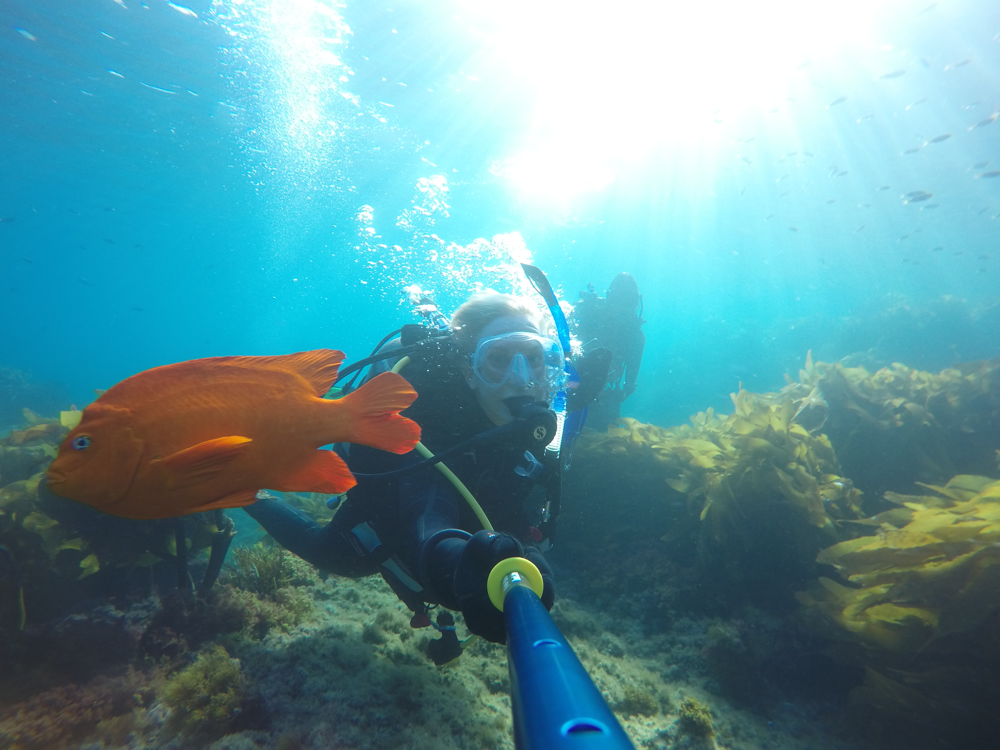

I consider myself a field Marine Biologist by training, with a specific interest in invertebrates and their sensory worlds. My research integrates questions in sensory biology, evolutionary biology, and ecology with a functional, behavioral perspective. There are many fascinating physiological, neurobiological, and sensory processes happening in these animals, and integrating knowledge of such processes with behavior can give us an excellent perspective on the consequences for individuals themselves as well as the populations, communities, and ecosystems they inhabit. I have primarily worked with echinoderms, which are drivers of ecological community structure in many benthic ocean habitats.

While I have had a lifelong interest in animals and the natural world, my professional science training began at UCLA where I did my BS and MS in the Department of Ecology & Evolutionary Biology. I carried my interest and research with sea urchin vision from my Master's studies with [Dr. Malcolm S. Gordon](https://www.eeb.ucla.edu/indivfaculty/?faculty=Gordon) to my PhD work in [Dr. Sönke Johnsen's lab](https://opticsoflife.org) at Duke where I also studied brittle star learning. I am currently a postdoctoral scholar at [Friday Harbor Labs](https://fhl.uw.edu) where I study the eyes of sea stars.

If you'd like to get in touch, email me at julia.c.notar (at) gmail.com  
[Bluesky](https://bsky.app/profile/jnotar.bsky.social) | [Google Scholar](https://scholar.google.com/citations?user=eQlRnmEAAAAJ&hl=en&oi=ao) | [ORCiD](https://orcid.org/0000-0002-5353-2102)

{:width="702px"}
