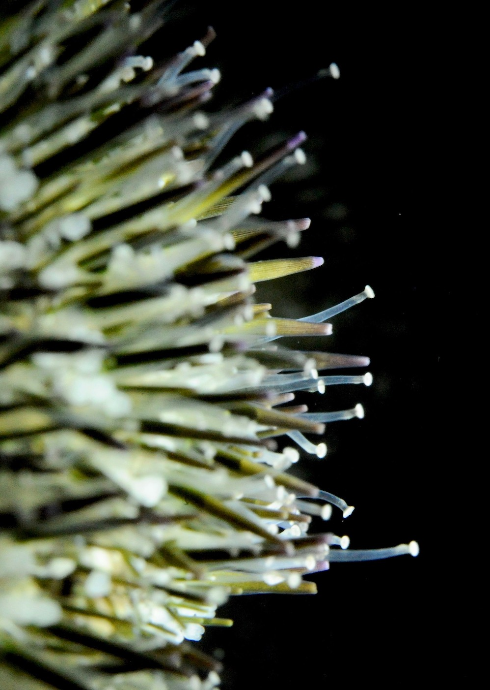
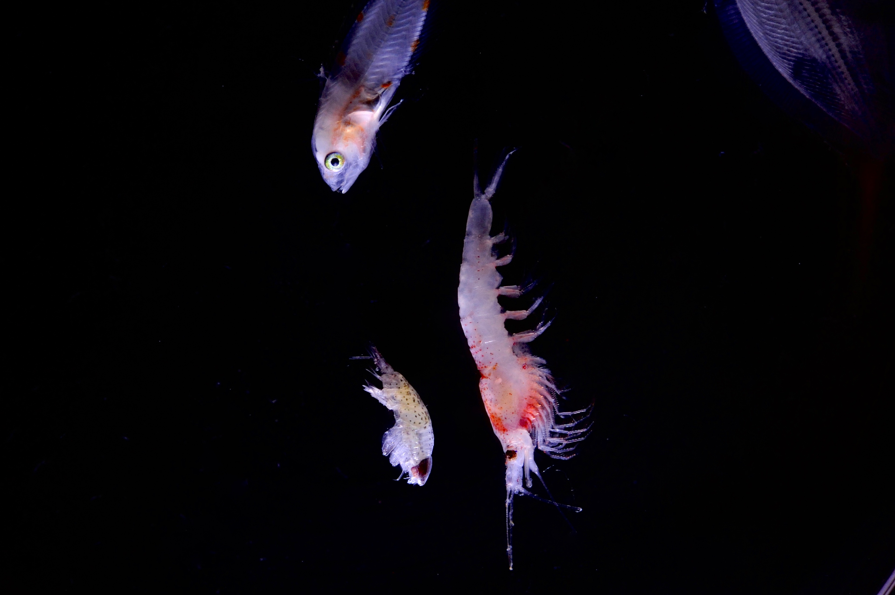

{:width="702px"}

{:width="350px"}
{:width="350px"}

{:width="702px"}

{:width="350px"}
{:width="350px"}

{:width="702px"}

{:width="350px"}
{:width="350px"}

{:width="702px"}

{:width="350px"}
{:width="350px"}

{:width="702px"}
